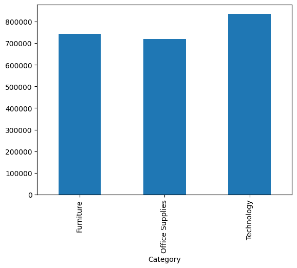
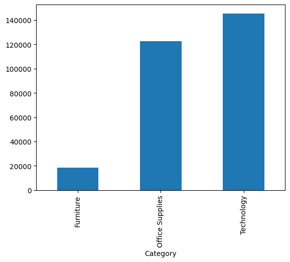
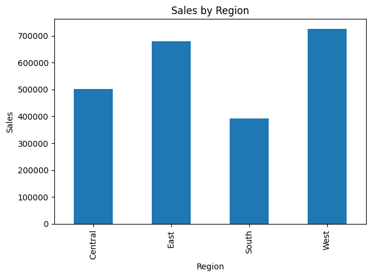
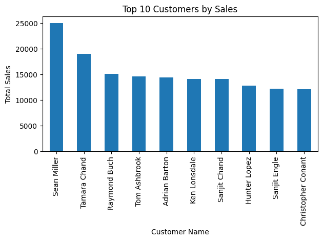
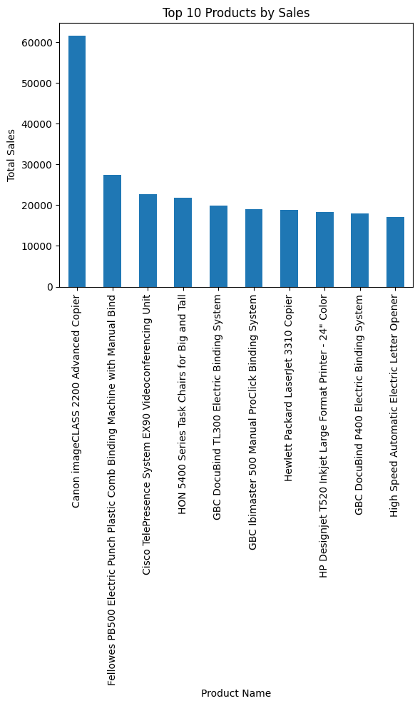
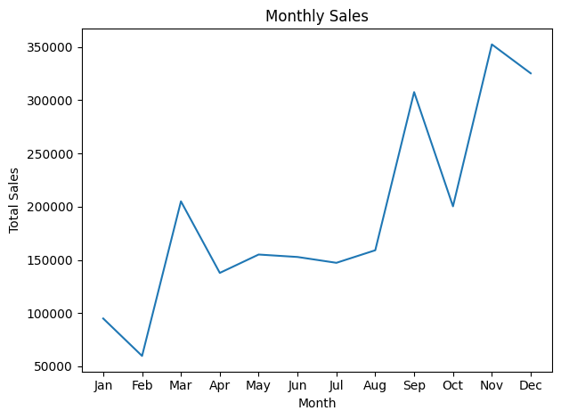
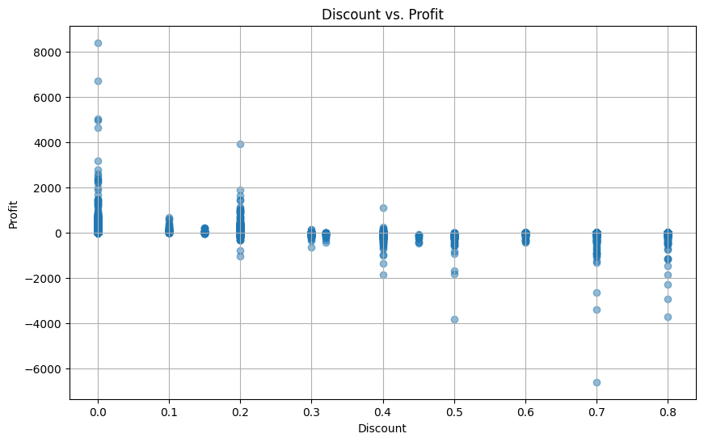

# Global Superstore Sales Analysis using Python

## Project Overview

This project analyzes the Global Superstore dataset using Python, Pandas, and Matplotlib.

The objective is to uncover business insights related to sales performance, profitability, customer behavior, product performance, seasonal trends, and discount impact.

---

## Tools & Technologies

- Python
- Pandas
- NumPy
- Matplotlib
- Jupyter Notebook

---

## Project Objectives

- Understand business performance using data analysis.
- Identify top-performing products and categories.
- Analyze profit trends across categories.
- Study monthly sales patterns.
- Evaluate the impact of discounts on profitability.
- Generate actionable business recommendations.

---

## Dataset Information

Dataset: Global Superstore Dataset

Key Fields:

- Sales
- Profit
- Discount
- Quantity
- Category
- Product Name
- Customer Name
- Region
- Order Date

---

## Analysis Performed

### Phase 1 — Data Understanding

- Dataset overview
- Data types
- Missing values analysis

### Phase 2 — Data Cleaning

- Missing value check
- Duplicate record check
- Data preparation

### Phase 3 — Business KPIs

- Total Sales
- Total Profit
- Total Orders
- Total Customers
- Average Discount

### Phase 4 — Category Analysis

- Sales by Category

### Phase 5 — Profit Analysis

- Profit by Category

### Phase 6 — Customer Analysis

- Top Customers by Sales

### Phase 7 — Product Analysis

- Top 10 Products by Sales

### Phase 8 — Time Analysis

- Monthly Sales Trend

### Phase 9 — Discount Impact

- Discount vs Profit Relationship

---

# Visualizations

## Sales by Category



---

## Profit by Category



---

## Region Sales Analysis



---

## Top Customers



---

## Top Products



---

## Monthly Sales Trend



---

## Discount vs Profit



---

## Key Business Insights

### Sales Performance

- Technology generated the highest sales.
- Office Supplies and Furniture contributed significantly to revenue.

### Profitability

- Technology category produced the highest profit.
- Furniture generated lower profit compared to sales volume.

### Customer Insights

- A small number of customers contributed a large portion of revenue.
- Customer concentration indicates opportunities for loyalty programs.

### Product Insights

- Several products significantly outperform others in sales.
- Top-selling products drive a large share of total revenue.

### Seasonal Trends

- Sales peak during the final months of the year.
- Strong year-end demand indicates seasonal purchasing behavior.

### Discount Impact

- Higher discounts generally reduce profitability.
- Excessive discounting can result in negative profits.

---

## Repository Structure

```text
superstore-sales-analysis-python
│
├── Dataset
├── Notebook
├── Visualizations
├── Business Insights
└── README.md
```

---

## Author

Sandeep Tiwari

Aspiring Data Analyst | Power BI | SQL | Python | Data Visualization

---

## Project Status

Completed
